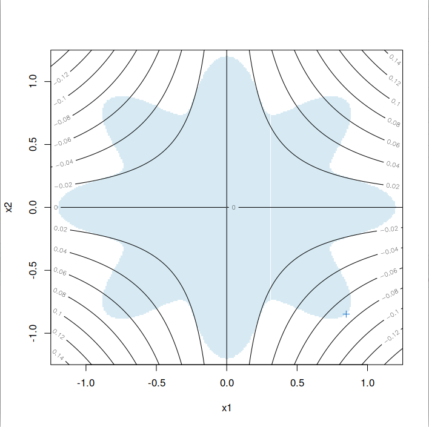
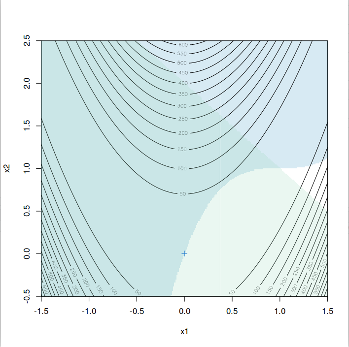
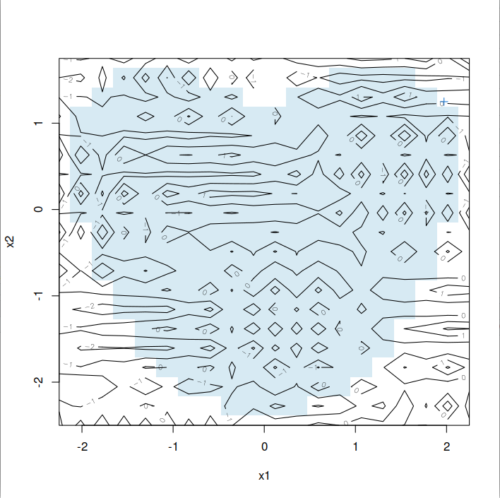
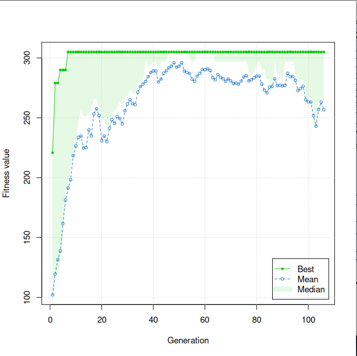

# Algorytmy genetyczne

* Imię i nazwisko: Zbigniew Czarnecki
* Indeks: 40873
* Kierunek: Informatyka
* Specjalizacja: Projektowanie systemów informatycznych i analiza danych
* Przedmiot: Algorytmy genetyczne
* Prowadzący: dr inż. Mateusz Gorczyca

## Implementacja projektu

Zadania zostały zaimplementowane w języku w PHP 8.

Aby uruchomić zaimplementowane algorytmy konieczne jest zainstalowanie maszyny wirtualnej języka PHP 8.

Oraz zainstalowanie narzędzia _composer_, które wygeneruje plik odpowiedzialny za wczytywanie klas na bazie PSR-4.

Projekt został zaimplementowany z wykorzystaniem programowania obiektowego
z podziałem kodu na odpowiednie pakiety i konteksty odpowiedzialności.

Dla zapewnienia poprawności implementacji zostały zrealizowane
testy jednostkowe weryfikujące poprawność implementowanych zachowań.

## Instalacja projektu

Po zainstalowaniu maszyny języka PHP 8 oraz narzędzia composer,
jeśli w projekcie brakuje katalogu _vendor_ należy wywołać poniższe polecenie.

```
composer install
```

## Uruchomienie algorytmów (skrypty wykonywalne)

Metoda gradientu prostego dla funkcji

```
./gradient.php
```

Algorytm przeszukiwania lokalnego dla funkcji

```
./greedyAlgorithm.php
```

Algorytm wyżarzania dla funkcji

```
./annealing.php
```

Algorytm genetyczny dla funkcji

```
./genetic.php
```

Algorytm genetyczny dla problemu komiwojażera

```
./genetic-tsp.php
```

Uruchomienie testów jednostkowych w projekcie

```
./vendor/bin/phpunit ./Tests/
```

Poniżej opis implementacji wraz z odwołaniami do klas implementujących poszczególne algorytmy.

## Zadanie 1

Dla problemu minimalizacji wartości funkcji ciągłej f(x) = x * sin (10 * PI * x) + 1 w przedziale x ∈ [-1;2]

Klasa reprezentująca powyższą funkcję została zaimplementowana w pliku:

```
./Functions/Func.php
```

Implementacja klasy Func dostarcza:
* Obliczanie wartości po funkcji _x_,
* Obliczanie wartości pochodnej funkcji po _x_,
* Obliczanie wartości po _x_ na podstawie obiektu klasy reprezentacji binarnej,

Testy weryfikujące klasę `./Functions/Func.php`

```
./Tests/Func/FuncTest.php
```

### a) wykorzystaj metodę gradientu prostego

Metoda gradientu prostego została zaimplementowana w klasie:

```
./Algorithms/Func/GradientDescent.php
```

W ramach metody _algorithm_ zaimplementowano poszukiwanie optimum dzięki metodzie gradientu prostego.

Wydajność algorytmy można konfigurować poprzez wartości:

* Maksymalnej ilości iteracji,
* Wartości kroku,
* Współczynnika tolerancji poprawy wyniku,

Testy weryfikujące klasę `./Algorithms/Func/GradientDescent.php`

```
./Tests/Algorithms/Func/GradientDescentTest.php
```

Przykładowy wynik wywołania algorytmu:

```
/bin/php /home/reyzeer/projects/dsw/algorytmy-genetyczne/algorytmy-genetyczne/gradient.php
Step 0. f(-0.74820917802076) = 0.25297463484756 
Step 1. f(-0.74844119380992) = 0.25245607977122 
Step 2. f(-0.74865617409004) = 0.25201089939053 
Step 3. f(-0.74885534998795) = 0.25162878483319 
Step 4. f(-0.74903986711297) = 0.25130085823685 
Step 5. f(-0.74921079086664) = 0.25101947826909 
Step 6. f(-0.74936911154451) = 0.25077807105914 
Step 7. f(-0.74951574921182) = 0.25057098347674 
Step 8. f(-0.74965155834195) = 0.25039335599621 
Step 9. f(-0.74977733221279) = 0.25024101267551 
Step 10. f(-0.74989380706054) = 0.2501103660549 
Step 11. f(-0.75000166599375) = 0.24999833503351 
Result: f(-0.75000166599375) = 0.24999833503351
Time: 0.00043511390686035
```

Przykładowa znalezione wartość zbliżająca się do minimum: f(-0.75000166599375) = 0.24999833503351

Czas przetwarzania: 0.00043511390686035 sekundy

### b) stwórz funkcję sąsiedztwa w reprezentacji binarnej

Klasa implementująca reprezentację binarną:

```
./Representations/Func/Binary.php
```

Klasa ta:

* Przechowuje obecnie badaną wartość jako ciąg 0 i 1,
* Jako iterator pozwala przesuwać się o jedną wartość w lewo lub prawo, a także o skok określaną wartość skoku, dla algorytmu wyżarzania,
* Dostarcza funkcje badające czy minimum lokalne znajduje się po lewej lub prawej stronie danej wartości reprezentacji,
* Na potrzeby algorytmu genetyczne posiada metody krzyżowania i mutacji,

Za zamianę wartości reprezentacji na wartość _x_ odpowiada metoda _convertRepresentationToX_ z klasy:

```
./Functions/Func.php
```

Testy weryfikujące klasę `./Representations/Func/Binary.php`

```
./Tests/Representations/Func/BinaryTest.php
```

### c) wykorzystaj tę funkcję w zaimplementowanym przez siebie algorytmie przeszukiwania lokalnego (iteracyjne wybieranie najbliższego punktu z sąsiedztwa dopóki można ulepszyć wartość funkcji celu),

Algorytm przeszukiwania lokalnego został zaimplementowany w klasie:

```
./Algorithms/Func/GreedyAlgorithmBinary.php
```

W ramach metody _algorithm_ zaimplementowano poszukiwanie minimum lokalnego.

Testy weryfikujące klasę `./Algorithms/Func/GreedyAlgorithmBinary.php`

```
./Tests/Algorithms/Func/GreedyAlgorithmTest.php
```

Przykładowy wynik wywołania algorytmu:

```
(...)
Step 51521. f(0100011111111100101101 : -0.15640071783083) = 0.84675067086154 
Step 51522. f(0100011111111100101110 : -0.15640000257492) = 0.84675066981074 
Step 51523. f(0100011111111100101111 : -0.15639928731901) = 0.84675066884373 
Step 51524. f(0100011111111100110000 : -0.15639857206311) = 0.84675066796052 
Step 51525. f(0100011111111100110001 : -0.1563978568072) = 0.8467506671611 
Step 51526. f(0100011111111100110010 : -0.15639714155129) = 0.84675066644548 
Step 51527. f(0100011111111100110011 : -0.15639642629538) = 0.84675066581366 
Step 51528. f(0100011111111100110100 : -0.15639571103947) = 0.84675066526563 
Step 51529. f(0100011111111100110101 : -0.15639499578357) = 0.8467506648014 
Step 51530. f(0100011111111100110110 : -0.15639428052766) = 0.84675066442096 
Step 51531. f(0100011111111100110111 : -0.15639356527175) = 0.84675066412431 
Step 51532. f(0100011111111100111000 : -0.15639285001584) = 0.84675066391145 
Step 51533. f(0100011111111100111001 : -0.15639213475994) = 0.84675066378238 
Step 51534. f(0100011111111100111010 : -0.15639141950403) = 0.84675066373711 
Step 51535. f(0100011111111100111011 : -0.15639070424812) = 0.84675066377562 
Result: f(0100011111111100111010 : -0.15639141950403) = 0.84675066373711
Time: 0.51100015640259
```

Przykładowe znalezione minimum lokalne: f(0100011111111100111010 : -0.15639141950403) = 0.84675066373711

Czas przetwarzania: 0.00043511390686035 sekundy

### d) wykorzystaj tę funkcję w zaimplementowanym przez siebie algorytmie symulowanego wyżarzania (należy stworzyć sposób generowania losowego punktu z sąsiedztwa),

Algorytm symulowane wyżarzania został zaimplementowany w klasie:

```
./Algorithms/Func/Annealing.php
```

W ramach metody _algorithm_ zaimplementowano algorytm symulowanego wyżarzania.

W założeniach przyjęto, że:

* algorytm symulowanego wyżarzania dąży do minimum lokalnego,
* algorytm w momencie sytuacji losowej determinowanej przez wartość punktu wyżarzania wykonuje skok o wartość binarną reprezentacji "1000000000" w lewo lub prawo, zależnie od kierunku dążenia do minimum dla wartości reprezentacji w danym momencie przetwarzania algorytmu,

Wydajność algorytmy można konfigurować poprzez wartości:

* Maksymalnej ilości iteracji dla obecnej temperatury,
* Wartości współczynnika alfa spadku temperatury,
* Temperaturę początkową,
* Temperaturę minimalną,
* Współczynnika tolerancji poprawy wyniku,

Testy weryfikujące klasę `./Algorithms/Func/Annealing.php`

```
./Tests/Algorithms/Func/AnnealingTest.php
```

Przykładowy wynik wywołania algorytmu:

```
(...)
Step 219968. f(0110011101000010011110 : 0.21007423641067) = 1.0653822892881 
Step 219969. f(0110011101001010011110 : 0.21044044743549) = 1.0677927214013 
Step 219970. f(0110011101001010011110 : 0.21044044743549) = 1.0677927214013 
Step 219971. f(0110011101010010011110 : 0.2108066584603) = 1.0702021574706 
Step 219972. f(0110011101010010011110 : 0.2108066584603) = 1.0702021574706 
Step 219973. f(0110011101011010011110 : 0.21117286948511) = 1.0726102468252 
Step 219974. f(0110011101011010011110 : 0.21117286948511) = 1.0726102468252 
Step 219975. f(0110011101100010011110 : 0.21153908050992) = 1.075016637921 
Step 219976. f(0110011101100010011110 : 0.21153908050992) = 1.075016637921 
Step 219977. f(0110011101101010011110 : 0.21190529153473) = 1.0774209783914 
Step 219978. f(0110011101101010011110 : 0.21190529153473) = 1.0774209783914 
Step 219979. f(0110011101110010011110 : 0.21227150255954) = 1.0798229150986 
Step 219980. f(0110011101110010011110 : 0.21227150255954) = 1.0798229150986 
Step 219981. f(0110011101111010011110 : 0.21263771358435) = 1.0822220941845 
Step 219982. f(0110011101111010011110 : 0.21263771358435) = 1.0822220941845 
Step 219983. f(0110011110000010011110 : 0.21300392460917) = 1.0846181611226 
Step 219984. f(0110011110000010011110 : 0.21300392460917) = 1.0846181611226 
Step 219985. f(0110011110001010011110 : 0.21337013563398) = 1.08701076077 
Step 219986. f(0110011110001010011110 : 0.21337013563398) = 1.08701076077 
Step 219987. f(0110011110010010011110 : 0.21373634665879) = 1.0893995374189 
Step 219988. f(0110011110010010011110 : 0.21373634665879) = 1.0893995374189 
Step 219989. f(0110011110011010011110 : 0.2141025576836) = 1.0917841348495 
Step 219990. f(0110011110011010011110 : 0.2141025576836) = 1.0917841348495 
Step 219991. f(0110011110100010011110 : 0.21446876870841) = 1.0941641963817 
Step 219992. f(0110011110100010011110 : 0.21446876870841) = 1.0941641963817 
Step 219993. f(0110011110101010011110 : 0.21483497973322) = 1.0965393649286 
Step 219994. f(0110011110101010011110 : 0.21483497973322) = 1.0965393649286 
Step 219995. f(0110011110110010011110 : 0.21520119075804) = 1.0989092830486 
Step 219996. f(0110011110110010011110 : 0.21520119075804) = 1.0989092830486 
Step 219997. f(0110011110111010011110 : 0.21556740178285) = 1.1012735929987 
Step 219998. f(0110011110111010011110 : 0.21556740178285) = 1.1012735929987 
Step 219999. f(0110011111000010011110 : 0.21593361280766) = 1.1036319367879 
Result: f(1111101111001010011111 : 1.9506759525957) = -0.95023613658052
Jumps: 109858
Colds: 142
Time: 2.0700480937958
```

Przykładowa znalezione wartość zbliżająca się do minimum: f(1111101111001010011111 : 1.9506759525957) = -0.95023613658052

Czas przetwarzania: 2.0700480937958 sekundy

### e) zaimplementować omawiany na wykładzie algorytm genetyczny dla reprezentacji 22-bitowej.

Algorytm genetyczny został zaimplementowany w traitcie:

```
./Algorithms/GeneticAlgorithm.php
```

Jest to uniwersalny trait, który jest bazą dla algorytmu genetyczne poszukującego minimum funkcji z zadania 1,
jak i dla poszukiwania rozwiązania problemu komiwojażera z zadania drugiego.
Algorytm zaimplementowano w ramach metody _algorithm_.

Kroki algorytmu genetycznego:

1. Wygenerowanie losowej populacji początkowej,
2. Selekcja najlepszych osobników,
3. Krzyżowanie osobników,
4. Przygotowanie populacji dla kolejnej iteracji,
5. Losowa mutacji, części osobników w populacji,
6. Weryfikacja czy od zdefiniowanej wcześniej liczby iteracji nie ma poprawy,
7. Jeśli nie jest to ostatnia iteracja powrót do kroku 2.

Wydajność algorytmy można konfigurować poprzez wartości:

* Wielkość populacji,
* Współczynnik przeżywalności,
* Ilość iteracji,
* Minimalna ilość iteracji,
* Ilość iteracji bez poprawy wyniku, po których należy przerwać algorytm,
* Prawdopodobieństwo mutacji,

Klasa determinująca zachowania algorytmu genetycznego dla funkcji z zadania 1 to:

```
./Algorithms/Func/Genetic.php
```

Implementacje metod mutacji są osadzone w klasie reprezentacji binarnej:

```
./Representations/Func/Binary.php
```

Mutacja została zaimplementowana jako podział ciągu bitowego na pół.
Gdzie pierwszej 11 bitów jest branych z pierwszego ciągu, a drugie 11 bitów z drugiego ciągu.

Krzyżowanie zostało zaimplementowane, jako losowa zmiana jednego bitu na wartość przeciwną.

Testy weryfikujące klasy `./Algorithms/Func/Genetic.php`, `./Representations/Func/Binary.php` i trait `./Algorithms/GeneticAlgorithm.php`

```
./Tests/Algorithms/Func/GeneticTest.php
./Tests/Representations/Func/BinaryTest.php
```

Przykładowy wynik wywołania algorytmu:

```
(...)
Step 5985. f(1111101111000111000100 : 1.9505193115519) = -0.95025973447465 
Step 5986. f(1111101111000111000100 : 1.9505193115519) = -0.95025973447465 
Step 5987. f(1111101111000111000100 : 1.9505193115519) = -0.95025973447465 
Step 5988. f(1111101111000111000100 : 1.9505193115519) = -0.95025973447465 
Step 5989. f(1111101111000111000100 : 1.9505193115519) = -0.95025973447465 
Step 5990. f(1111101111000111000100 : 1.9505193115519) = -0.95025973447465 
Step 5991. f(1111101111000111000100 : 1.9505193115519) = -0.95025973447465 
Step 5992. f(1111101111000111000100 : 1.9505193115519) = -0.95025973447465 
Step 5993. f(1111101111000111000100 : 1.9505193115519) = -0.95025973447465 
Step 5994. f(1111101111000111000100 : 1.9505193115519) = -0.95025973447465 
Step 5995. f(1111101111000111000100 : 1.9505193115519) = -0.95025973447465 
Step 5996. f(1111101111000111000100 : 1.9505193115519) = -0.95025973447465 
Step 5997. f(1111101111000111000100 : 1.9505193115519) = -0.95025973447465 
Step 5998. f(1111101111000111000100 : 1.9505193115519) = -0.95025973447465 
Step 5999. f(1111101111000111000100 : 1.9505193115519) = -0.95025973447465 
Step 6000. f(1111101111000111000100 : 1.9505193115519) = -0.95025973447465 
Step 6001. f(1111101111000111000100 : 1.9505193115519) = -0.95025973447465 
Result: f(1111101111000111000100 : 1.9505193115519) = -0.95025973447465
Time: 3.006490945816
```

Przykładowa znalezione wartość zbliżająca się do minimum: f(1111101111000111000100 : 1.9505193115519) = -0.95025973447465

Czas przetwarzania: 3.006490945816 sekundy

## Zadanie 2

Algorytm genetyczny został zaimplementowany w traitcie:

```
./Algorithms/GeneticAlgorithm.php
```

Ponieważ algorytm dla zadania 1e, jak 2 bazuje na podstawie tego samego podejścia
i głównej bazy kroków. Te są również takie, same jak we wcześniejszym rozwiązaniu:

Kroki algorytmu genetycznego:

1. Wygenerowanie losowej populacji początkowej,
2. Selekcja najlepszych osobników,
3. Krzyżowanie osobników,
4. Przygotowanie populacji dla kolejnej iteracji,
5. Losowa mutacji, części osobników w populacji,
6. Weryfikacja czy od zdefiniowanej wcześniej liczby iteracji nie ma poprawy,
7. Jeśli nie jest to ostatnia iteracja powrót do kroku 2.

Wydajność algorytmy można konfigurować poprzez wartości:

* Wielkość populacji,
* Współczynnik przeżywalności,
* Ilość iteracji,
* Minimalna ilość iteracji,
* Ilość iteracji bez poprawy wyniku, po których należy przerwać algorytm,
* Prawdopodobieństwo mutacji,

Klasa determinująca zachowania algorytmu genetycznego dla problemu komiwojażera to:

```
./Algorithms/TSP/Genetic.php
```

W przypadku tego algorytmu została wykorzystana inna implementacja klasa reprezentacji:

```
./TSP/Route.php
```

Reprezentacja ta bazuje, na kodowaniu ścieżki. Czyli budowaniu,
jej na podstawie pobierania n-tego wierzchołka z pozostałych budujących graf,
jeszcze nieużytego w danej ścieżce. Przykład:

Dla wierzchołków: [0, 1, 2, 3, 4]

I kodowania: [1, 1, 2, 0, 0]

Uzyskamy ścieżkę: [1, 2, 4, 0, 3]

Klasa ścieżki dostarcza funkcjonalności:

* Generowania losowej ścieżki,
* Policzenia kosztu ścieżki z wykorzystaniem klasy grafu: `./Representations/TSP/Graph.php`,
* Zdekodowania ścieżki,
* Krzyżowania, poprzez zabrania pierwszej połowy kodowania z pierwszego osobnika, i drugiej połowy z drugiego osobnika,
* Mutacji, poprzez zamianę n-tego elementu kodowania, na wartość z zakresu od 0 do n, z wymuszeniem zmiany wartości na inną, oraz niemutowaniu elementu na pozycji ostatniej, który musi być 0,

Testy weryfikujące klasy `./Algorithms/TSP/Genetic.php`, `../TSP/Route.php` i trait `./Algorithms/GeneticAlgorithm.php`

```
./Tests/Algorithms/TSP/GeneticTest.php
./Tests/Representations/TSP/RouteTest.php
```

Aby umożliwić wczytanie dostarczonych ze zbioru [5] grafów została zaimplementowana klasa wczytująca te pliki:

```
./Reader/TSPCoordReader.php
```

Wraz z builderem reprezentacji grafu na potrzeby oraz samą klasą grafu:

```
./Builder/GraphBuilder.php
./TSP/Graph.php
```

Klasy te weryfikują testy:

```
./Tests/Reader/TSPCoordReaderTest.php
./Tests/Builder/GraphBuilderTest.php
```

### Przykładowe wyniki uruchomienia algorytmu genetycznego dla TSP i danych ze zbioru [5]

#### Plik `./Files/TSP/ch150.tsp`

```
(...)
10451. Route: 61 - 148 - 17 - 145 - 136 - 119 - 59 - 43 - 135 - 70 - 105 - 19 - 39 - 23 - 52 - 68 - 100 - 11 - 122 - 118 - 3 - 2 - 139 - 143 - 37 - 92 - 4 - 33 - 34 - 125 - 103 - 127 - 124 - 29 - 67 - 12 - 75 - 72 - 88 - 7 - 93 - 149 - 137 - 133 - 115 - 74 - 99 - 142 - 82 - 8 - 18 - 131 - 80 - 77 - 63 - 121 - 126 - 57 - 13 - 71 - 111 - 73 - 14 - 15 - 32 - 54 - 101 - 134 - 109 - 104 - 9 - 110 - 10 - 60 - 50 - 36 - 46 - 35 - 22 - 147 - 16 - 130 - 66 - 6 - 83 - 53 - 108 - 31 - 91 - 49 - 107 - 1 - 45 - 76 - 48 - 116 - 56 - 38 - 90 - 44 - 21 - 79 - 30 - 114 - 120 - 87 - 62 - 24 - 28 - 85 - 27 - 113 - 69 - 138 - 26 - 144 - 65 - 129 - 117 - 5 - 84 - 141 - 96 - 140 - 41 - 98 - 64 - 94 - 81 - 106 - 123 - 102 - 97 - 86 - 146 - 42 - 40 - 128 - 20 - 78 - 58 - 132 - 51 - 0 - 25 - 55 - 89 - 95 - 47 - 112 - 61 - Cost: 28340.559890909
10452. Route: 61 - 148 - 17 - 145 - 136 - 119 - 59 - 43 - 135 - 70 - 105 - 19 - 39 - 23 - 52 - 68 - 100 - 11 - 122 - 118 - 3 - 2 - 139 - 143 - 37 - 92 - 4 - 33 - 34 - 125 - 103 - 127 - 124 - 29 - 67 - 12 - 75 - 72 - 88 - 7 - 93 - 149 - 137 - 133 - 115 - 74 - 99 - 142 - 82 - 8 - 18 - 131 - 80 - 77 - 63 - 121 - 126 - 57 - 13 - 71 - 111 - 73 - 14 - 15 - 32 - 54 - 101 - 134 - 109 - 104 - 9 - 110 - 10 - 60 - 50 - 36 - 46 - 35 - 22 - 147 - 16 - 130 - 66 - 6 - 83 - 53 - 108 - 31 - 91 - 49 - 107 - 1 - 45 - 76 - 48 - 116 - 56 - 38 - 90 - 44 - 21 - 79 - 30 - 114 - 120 - 87 - 62 - 24 - 28 - 85 - 27 - 113 - 69 - 138 - 26 - 144 - 65 - 129 - 117 - 5 - 84 - 141 - 96 - 140 - 41 - 98 - 64 - 94 - 81 - 106 - 123 - 102 - 97 - 86 - 146 - 42 - 40 - 128 - 20 - 78 - 58 - 132 - 51 - 0 - 25 - 55 - 89 - 95 - 47 - 112 - 61 - Cost: 28340.559890909
10453. Route: 61 - 148 - 17 - 145 - 136 - 119 - 59 - 43 - 135 - 70 - 105 - 19 - 39 - 23 - 52 - 68 - 100 - 11 - 122 - 118 - 3 - 2 - 139 - 143 - 37 - 92 - 4 - 33 - 34 - 125 - 103 - 127 - 124 - 29 - 67 - 12 - 75 - 72 - 88 - 7 - 93 - 149 - 137 - 133 - 115 - 74 - 99 - 142 - 82 - 8 - 18 - 131 - 80 - 77 - 63 - 121 - 126 - 57 - 13 - 71 - 111 - 73 - 14 - 15 - 32 - 54 - 101 - 134 - 109 - 104 - 9 - 110 - 10 - 60 - 50 - 36 - 46 - 35 - 22 - 147 - 16 - 130 - 66 - 6 - 83 - 53 - 108 - 31 - 91 - 49 - 107 - 1 - 45 - 76 - 48 - 116 - 56 - 38 - 90 - 44 - 21 - 79 - 30 - 114 - 120 - 87 - 62 - 24 - 28 - 85 - 27 - 113 - 69 - 138 - 26 - 144 - 65 - 129 - 117 - 5 - 84 - 141 - 96 - 140 - 41 - 98 - 64 - 94 - 81 - 106 - 123 - 102 - 97 - 86 - 146 - 42 - 40 - 128 - 20 - 78 - 58 - 132 - 51 - 0 - 25 - 55 - 89 - 95 - 47 - 112 - 61 - Cost: 28340.559890909
10454. Route: 61 - 148 - 17 - 145 - 136 - 119 - 59 - 43 - 135 - 70 - 105 - 19 - 39 - 23 - 52 - 68 - 100 - 11 - 122 - 118 - 3 - 2 - 139 - 143 - 37 - 92 - 4 - 33 - 34 - 125 - 103 - 127 - 124 - 29 - 67 - 12 - 75 - 72 - 88 - 7 - 93 - 149 - 137 - 133 - 115 - 74 - 99 - 142 - 82 - 8 - 18 - 131 - 80 - 77 - 63 - 121 - 126 - 57 - 13 - 71 - 111 - 73 - 14 - 15 - 32 - 54 - 101 - 134 - 109 - 104 - 9 - 110 - 10 - 60 - 50 - 36 - 46 - 35 - 22 - 147 - 16 - 130 - 66 - 6 - 83 - 53 - 108 - 31 - 91 - 49 - 107 - 1 - 45 - 76 - 48 - 116 - 56 - 38 - 90 - 44 - 21 - 79 - 30 - 114 - 120 - 87 - 62 - 24 - 28 - 85 - 27 - 113 - 69 - 138 - 26 - 144 - 65 - 129 - 117 - 5 - 84 - 141 - 96 - 140 - 41 - 98 - 64 - 94 - 81 - 106 - 123 - 102 - 97 - 86 - 146 - 42 - 40 - 128 - 20 - 78 - 58 - 132 - 51 - 0 - 25 - 55 - 89 - 95 - 47 - 112 - 61 - Cost: 28340.559890909
10455. Route: 61 - 148 - 17 - 145 - 136 - 119 - 59 - 43 - 135 - 70 - 105 - 19 - 39 - 23 - 52 - 68 - 100 - 11 - 122 - 118 - 3 - 2 - 139 - 143 - 37 - 92 - 4 - 33 - 34 - 125 - 103 - 127 - 124 - 29 - 67 - 12 - 75 - 72 - 88 - 7 - 93 - 149 - 137 - 133 - 115 - 74 - 99 - 142 - 82 - 8 - 18 - 131 - 80 - 77 - 63 - 121 - 126 - 57 - 13 - 71 - 111 - 73 - 14 - 15 - 32 - 54 - 101 - 134 - 109 - 104 - 9 - 110 - 10 - 60 - 50 - 36 - 46 - 35 - 22 - 147 - 16 - 130 - 66 - 6 - 83 - 53 - 108 - 31 - 91 - 49 - 107 - 1 - 45 - 76 - 48 - 116 - 56 - 38 - 90 - 44 - 21 - 79 - 30 - 114 - 120 - 87 - 62 - 24 - 28 - 85 - 27 - 113 - 69 - 138 - 26 - 144 - 65 - 129 - 117 - 5 - 84 - 141 - 96 - 140 - 41 - 98 - 64 - 94 - 81 - 106 - 123 - 102 - 97 - 86 - 146 - 42 - 40 - 128 - 20 - 78 - 58 - 132 - 51 - 0 - 25 - 55 - 89 - 95 - 47 - 112 - 61 - Cost: 28340.559890909
10456. Route: 61 - 148 - 17 - 145 - 136 - 119 - 59 - 43 - 135 - 70 - 105 - 19 - 39 - 23 - 52 - 68 - 100 - 11 - 122 - 118 - 3 - 2 - 139 - 143 - 37 - 92 - 4 - 33 - 34 - 125 - 103 - 127 - 124 - 29 - 67 - 12 - 75 - 72 - 88 - 7 - 93 - 149 - 137 - 133 - 115 - 74 - 99 - 142 - 82 - 8 - 18 - 131 - 80 - 77 - 63 - 121 - 126 - 57 - 13 - 71 - 111 - 73 - 14 - 15 - 32 - 54 - 101 - 134 - 109 - 104 - 9 - 110 - 10 - 60 - 50 - 36 - 46 - 35 - 22 - 147 - 16 - 130 - 66 - 6 - 83 - 53 - 108 - 31 - 91 - 49 - 107 - 1 - 45 - 76 - 48 - 116 - 56 - 38 - 90 - 44 - 21 - 79 - 30 - 114 - 120 - 87 - 62 - 24 - 28 - 85 - 27 - 113 - 69 - 138 - 26 - 144 - 65 - 129 - 117 - 5 - 84 - 141 - 96 - 140 - 41 - 98 - 64 - 94 - 81 - 106 - 123 - 102 - 97 - 86 - 146 - 42 - 40 - 128 - 20 - 78 - 58 - 132 - 51 - 0 - 25 - 55 - 89 - 95 - 47 - 112 - 61 - Cost: 28340.559890909
10457. Route: 61 - 148 - 17 - 145 - 136 - 119 - 59 - 43 - 135 - 70 - 105 - 19 - 39 - 23 - 52 - 68 - 100 - 11 - 122 - 118 - 3 - 2 - 139 - 143 - 37 - 92 - 4 - 33 - 34 - 125 - 103 - 127 - 124 - 29 - 67 - 12 - 75 - 72 - 88 - 7 - 93 - 149 - 137 - 133 - 115 - 74 - 99 - 142 - 82 - 8 - 18 - 131 - 80 - 77 - 63 - 121 - 126 - 57 - 13 - 71 - 111 - 73 - 14 - 15 - 32 - 54 - 101 - 134 - 109 - 104 - 9 - 110 - 10 - 60 - 50 - 36 - 46 - 35 - 22 - 147 - 16 - 130 - 66 - 6 - 83 - 53 - 108 - 31 - 91 - 49 - 107 - 1 - 45 - 76 - 48 - 116 - 56 - 38 - 90 - 44 - 21 - 79 - 30 - 114 - 120 - 87 - 62 - 24 - 28 - 85 - 27 - 113 - 69 - 138 - 26 - 144 - 65 - 129 - 117 - 5 - 84 - 141 - 96 - 140 - 41 - 98 - 64 - 94 - 81 - 106 - 123 - 102 - 97 - 86 - 146 - 42 - 40 - 128 - 20 - 78 - 58 - 132 - 51 - 0 - 25 - 55 - 89 - 95 - 47 - 112 - 61 - Cost: 28340.559890909
Best route: 61 - 148 - 17 - 145 - 136 - 119 - 59 - 43 - 135 - 70 - 105 - 19 - 39 - 23 - 52 - 68 - 100 - 11 - 122 - 118 - 3 - 2 - 139 - 143 - 37 - 92 - 4 - 33 - 34 - 125 - 103 - 127 - 124 - 29 - 67 - 12 - 75 - 72 - 88 - 7 - 93 - 149 - 137 - 133 - 115 - 74 - 99 - 142 - 82 - 8 - 18 - 131 - 80 - 77 - 63 - 121 - 126 - 57 - 13 - 71 - 111 - 73 - 14 - 15 - 32 - 54 - 101 - 134 - 109 - 104 - 9 - 110 - 10 - 60 - 50 - 36 - 46 - 35 - 22 - 147 - 16 - 130 - 66 - 6 - 83 - 53 - 108 - 31 - 91 - 49 - 107 - 1 - 45 - 76 - 48 - 116 - 56 - 38 - 90 - 44 - 21 - 79 - 30 - 114 - 120 - 87 - 62 - 24 - 28 - 85 - 27 - 113 - 69 - 138 - 26 - 144 - 65 - 129 - 117 - 5 - 84 - 141 - 96 - 140 - 41 - 98 - 64 - 94 - 81 - 106 - 123 - 102 - 97 - 86 - 146 - 42 - 40 - 128 - 20 - 78 - 58 - 132 - 51 - 0 - 25 - 55 - 89 - 95 - 47 - 112 - 61 - Cost: 28340.559890909
Time: 229.47649598122
```

Znaleziona ścieżka: 61 - 148 - 17 - 145 - 136 - 119 - 59 - 43 - 135 - 70 - 105 - 19 - 39 - 23 - 52 - 68 - 100 - 11 - 122 - 118 - 3 - 2 - 139 - 143 - 37 - 92 - 4 - 33 - 34 - 125 - 103 - 127 - 124 - 29 - 67 - 12 - 75 - 72 - 88 - 7 - 93 - 149 - 137 - 133 - 115 - 74 - 99 - 142 - 82 - 8 - 18 - 131 - 80 - 77 - 63 - 121 - 126 - 57 - 13 - 71 - 111 - 73 - 14 - 15 - 32 - 54 - 101 - 134 - 109 - 104 - 9 - 110 - 10 - 60 - 50 - 36 - 46 - 35 - 22 - 147 - 16 - 130 - 66 - 6 - 83 - 53 - 108 - 31 - 91 - 49 - 107 - 1 - 45 - 76 - 48 - 116 - 56 - 38 - 90 - 44 - 21 - 79 - 30 - 114 - 120 - 87 - 62 - 24 - 28 - 85 - 27 - 113 - 69 - 138 - 26 - 144 - 65 - 129 - 117 - 5 - 84 - 141 - 96 - 140 - 41 - 98 - 64 - 94 - 81 - 106 - 123 - 102 - 97 - 86 - 146 - 42 - 40 - 128 - 20 - 78 - 58 - 132 - 51 - 0 - 25 - 55 - 89 - 95 - 47 - 112 - 61 -

Koszt: 28340.559

Czas poszukiwania: 229.47649598122 sekund

#### Plik `./Files/TSP/a280.tsp`

```
(...)
17056. Route: 224 - 229 - 251 - 139 - 46 - 58 - 65 - 53 - 64 - 54 - 48 - 62 - 173 - 29 - 127 - 0 - 279 - 242 - 129 - 121 - 35 - 114 - 41 - 186 - 269 - 19 - 154 - 24 - 22 - 126 - 104 - 34 - 32 - 271 - 213 - 254 - 140 - 197 - 138 - 230 - 235 - 238 - 237 - 141 - 222 - 250 - 226 - 4 - 5 - 275 - 72 - 162 - 25 - 21 - 175 - 184 - 20 - 187 - 69 - 76 - 181 - 125 - 28 - 123 - 122 - 201 - 202 - 266 - 136 - 155 - 277 - 243 - 134 - 268 - 101 - 39 - 169 - 167 - 93 - 234 - 236 - 239 - 231 - 206 - 91 - 171 - 166 - 33 - 60 - 38 - 99 - 170 - 10 - 6 - 276 - 210 - 209 - 218 - 273 - 26 - 27 - 107 - 100 - 168 - 98 - 151 - 163 - 198 - 142 - 252 - 215 - 264 - 200 - 199 - 195 - 194 - 203 - 7 - 9 - 176 - 70 - 174 - 158 - 265 - 102 - 117 - 42 - 90 - 111 - 45 - 96 - 78 - 247 - 240 - 1 - 241 - 132 - 17 - 164 - 161 - 183 - 182 - 73 - 77 - 152 - 267 - 80 - 157 - 119 - 253 - 211 - 212 - 217 - 214 - 204 - 156 - 159 - 180 - 188 - 150 - 40 - 37 - 89 - 61 - 172 - 81 - 63 - 82 - 108 - 52 - 74 - 160 - 185 - 261 - 16 - 116 - 113 - 88 - 85 - 115 - 56 - 66 - 205 - 216 - 143 - 193 - 50 - 51 - 83 - 248 - 255 - 3 - 259 - 260 - 15 - 270 - 120 - 86 - 177 - 272 - 14 - 13 - 23 - 105 - 106 - 31 - 30 - 124 - 84 - 57 - 87 - 44 - 43 - 109 - 59 - 165 - 18 - 133 - 262 - 179 - 47 - 112 - 49 - 148 - 147 - 196 - 145 - 190 - 178 - 118 - 149 - 192 - 219 - 207 - 220 - 75 - 94 - 249 - 246 - 232 - 227 - 244 - 233 - 245 - 2 - 221 - 208 - 256 - 278 - 189 - 71 - 68 - 95 - 67 - 55 - 92 - 263 - 135 - 257 - 258 - 131 - 130 - 153 - 128 - 12 - 11 - 274 - 8 - 144 - 137 - 146 - 191 - 79 - 97 - 103 - 110 - 36 - 228 - 223 - 225 - 224 - Cost: 15634.625668731
17057. Route: 224 - 229 - 251 - 139 - 46 - 58 - 65 - 53 - 64 - 54 - 48 - 62 - 173 - 29 - 127 - 0 - 279 - 242 - 129 - 121 - 35 - 114 - 41 - 186 - 269 - 19 - 154 - 24 - 22 - 126 - 104 - 34 - 32 - 271 - 213 - 254 - 140 - 197 - 138 - 230 - 235 - 238 - 237 - 141 - 222 - 250 - 226 - 4 - 5 - 275 - 72 - 162 - 25 - 21 - 175 - 184 - 20 - 187 - 69 - 76 - 181 - 125 - 28 - 123 - 122 - 201 - 202 - 266 - 136 - 155 - 277 - 243 - 134 - 268 - 101 - 39 - 169 - 167 - 93 - 234 - 236 - 239 - 231 - 206 - 91 - 171 - 166 - 33 - 60 - 38 - 99 - 170 - 10 - 6 - 276 - 210 - 209 - 218 - 273 - 26 - 27 - 107 - 100 - 168 - 98 - 151 - 163 - 198 - 142 - 252 - 215 - 264 - 200 - 199 - 195 - 194 - 203 - 7 - 9 - 176 - 70 - 174 - 158 - 265 - 102 - 117 - 42 - 90 - 111 - 45 - 96 - 78 - 247 - 240 - 1 - 241 - 132 - 17 - 164 - 161 - 183 - 182 - 73 - 77 - 152 - 267 - 80 - 157 - 119 - 253 - 211 - 212 - 217 - 214 - 204 - 156 - 159 - 180 - 188 - 150 - 40 - 37 - 89 - 61 - 172 - 81 - 63 - 82 - 108 - 52 - 74 - 160 - 185 - 261 - 16 - 116 - 113 - 88 - 85 - 115 - 56 - 66 - 205 - 216 - 143 - 193 - 50 - 51 - 83 - 248 - 255 - 3 - 259 - 260 - 15 - 270 - 120 - 86 - 177 - 272 - 14 - 13 - 23 - 105 - 106 - 31 - 30 - 124 - 84 - 57 - 87 - 44 - 43 - 109 - 59 - 165 - 18 - 133 - 262 - 179 - 47 - 112 - 49 - 148 - 147 - 196 - 145 - 190 - 178 - 118 - 149 - 192 - 219 - 207 - 220 - 75 - 94 - 249 - 246 - 232 - 227 - 244 - 233 - 245 - 2 - 221 - 208 - 256 - 278 - 189 - 71 - 68 - 95 - 67 - 55 - 92 - 263 - 135 - 257 - 258 - 131 - 130 - 153 - 128 - 12 - 11 - 274 - 8 - 144 - 137 - 146 - 191 - 79 - 97 - 103 - 110 - 36 - 228 - 223 - 225 - 224 - Cost: 15634.625668731
17058. Route: 224 - 229 - 251 - 139 - 46 - 58 - 65 - 53 - 64 - 54 - 48 - 62 - 173 - 29 - 127 - 0 - 279 - 242 - 129 - 121 - 35 - 114 - 41 - 186 - 269 - 19 - 154 - 24 - 22 - 126 - 104 - 34 - 32 - 271 - 213 - 254 - 140 - 197 - 138 - 230 - 235 - 238 - 237 - 141 - 222 - 250 - 226 - 4 - 5 - 275 - 72 - 162 - 25 - 21 - 175 - 184 - 20 - 187 - 69 - 76 - 181 - 125 - 28 - 123 - 122 - 201 - 202 - 266 - 136 - 155 - 277 - 243 - 134 - 268 - 101 - 39 - 169 - 167 - 93 - 234 - 236 - 239 - 231 - 206 - 91 - 171 - 166 - 33 - 60 - 38 - 99 - 170 - 10 - 6 - 276 - 210 - 209 - 218 - 273 - 26 - 27 - 107 - 100 - 168 - 98 - 151 - 163 - 198 - 142 - 252 - 215 - 264 - 200 - 199 - 195 - 194 - 203 - 7 - 9 - 176 - 70 - 174 - 158 - 265 - 102 - 117 - 42 - 90 - 111 - 45 - 96 - 78 - 247 - 240 - 1 - 241 - 132 - 17 - 164 - 161 - 183 - 182 - 73 - 77 - 152 - 267 - 80 - 157 - 119 - 253 - 211 - 212 - 217 - 214 - 204 - 156 - 159 - 180 - 188 - 150 - 40 - 37 - 89 - 61 - 172 - 81 - 63 - 82 - 108 - 52 - 74 - 160 - 185 - 261 - 16 - 116 - 113 - 88 - 85 - 115 - 56 - 66 - 205 - 216 - 143 - 193 - 50 - 51 - 83 - 248 - 255 - 3 - 259 - 260 - 15 - 270 - 120 - 86 - 177 - 272 - 14 - 13 - 23 - 105 - 106 - 31 - 30 - 124 - 84 - 57 - 87 - 44 - 43 - 109 - 59 - 165 - 18 - 133 - 262 - 179 - 47 - 112 - 49 - 148 - 147 - 196 - 145 - 190 - 178 - 118 - 149 - 192 - 219 - 207 - 220 - 75 - 94 - 249 - 246 - 232 - 227 - 244 - 233 - 245 - 2 - 221 - 208 - 256 - 278 - 189 - 71 - 68 - 95 - 67 - 55 - 92 - 263 - 135 - 257 - 258 - 131 - 130 - 153 - 128 - 12 - 11 - 274 - 8 - 144 - 137 - 146 - 191 - 79 - 97 - 103 - 110 - 36 - 228 - 223 - 225 - 224 - Cost: 15634.625668731
17059. Route: 224 - 229 - 251 - 139 - 46 - 58 - 65 - 53 - 64 - 54 - 48 - 62 - 173 - 29 - 127 - 0 - 279 - 242 - 129 - 121 - 35 - 114 - 41 - 186 - 269 - 19 - 154 - 24 - 22 - 126 - 104 - 34 - 32 - 271 - 213 - 254 - 140 - 197 - 138 - 230 - 235 - 238 - 237 - 141 - 222 - 250 - 226 - 4 - 5 - 275 - 72 - 162 - 25 - 21 - 175 - 184 - 20 - 187 - 69 - 76 - 181 - 125 - 28 - 123 - 122 - 201 - 202 - 266 - 136 - 155 - 277 - 243 - 134 - 268 - 101 - 39 - 169 - 167 - 93 - 234 - 236 - 239 - 231 - 206 - 91 - 171 - 166 - 33 - 60 - 38 - 99 - 170 - 10 - 6 - 276 - 210 - 209 - 218 - 273 - 26 - 27 - 107 - 100 - 168 - 98 - 151 - 163 - 198 - 142 - 252 - 215 - 264 - 200 - 199 - 195 - 194 - 203 - 7 - 9 - 176 - 70 - 174 - 158 - 265 - 102 - 117 - 42 - 90 - 111 - 45 - 96 - 78 - 247 - 240 - 1 - 241 - 132 - 17 - 164 - 161 - 183 - 182 - 73 - 77 - 152 - 267 - 80 - 157 - 119 - 253 - 211 - 212 - 217 - 214 - 204 - 156 - 159 - 180 - 188 - 150 - 40 - 37 - 89 - 61 - 172 - 81 - 63 - 82 - 108 - 52 - 74 - 160 - 185 - 261 - 16 - 116 - 113 - 88 - 85 - 115 - 56 - 66 - 205 - 216 - 143 - 193 - 50 - 51 - 83 - 248 - 255 - 3 - 259 - 260 - 15 - 270 - 120 - 86 - 177 - 272 - 14 - 13 - 23 - 105 - 106 - 31 - 30 - 124 - 84 - 57 - 87 - 44 - 43 - 109 - 59 - 165 - 18 - 133 - 262 - 179 - 47 - 112 - 49 - 148 - 147 - 196 - 145 - 190 - 178 - 118 - 149 - 192 - 219 - 207 - 220 - 75 - 94 - 249 - 246 - 232 - 227 - 244 - 233 - 245 - 2 - 221 - 208 - 256 - 278 - 189 - 71 - 68 - 95 - 67 - 55 - 92 - 263 - 135 - 257 - 258 - 131 - 130 - 153 - 128 - 12 - 11 - 274 - 8 - 144 - 137 - 146 - 191 - 79 - 97 - 103 - 110 - 36 - 228 - 223 - 225 - 224 - Cost: 15634.625668731
17060. Route: 224 - 229 - 251 - 139 - 46 - 58 - 65 - 53 - 64 - 54 - 48 - 62 - 173 - 29 - 127 - 0 - 279 - 242 - 129 - 121 - 35 - 114 - 41 - 186 - 269 - 19 - 154 - 24 - 22 - 126 - 104 - 34 - 32 - 271 - 213 - 254 - 140 - 197 - 138 - 230 - 235 - 238 - 237 - 141 - 222 - 250 - 226 - 4 - 5 - 275 - 72 - 162 - 25 - 21 - 175 - 184 - 20 - 187 - 69 - 76 - 181 - 125 - 28 - 123 - 122 - 201 - 202 - 266 - 136 - 155 - 277 - 243 - 134 - 268 - 101 - 39 - 169 - 167 - 93 - 234 - 236 - 239 - 231 - 206 - 91 - 171 - 166 - 33 - 60 - 38 - 99 - 170 - 10 - 6 - 276 - 210 - 209 - 218 - 273 - 26 - 27 - 107 - 100 - 168 - 98 - 151 - 163 - 198 - 142 - 252 - 215 - 264 - 200 - 199 - 195 - 194 - 203 - 7 - 9 - 176 - 70 - 174 - 158 - 265 - 102 - 117 - 42 - 90 - 111 - 45 - 96 - 78 - 247 - 240 - 1 - 241 - 132 - 17 - 164 - 161 - 183 - 182 - 73 - 77 - 152 - 267 - 80 - 157 - 119 - 253 - 211 - 212 - 217 - 214 - 204 - 156 - 159 - 180 - 188 - 150 - 40 - 37 - 89 - 61 - 172 - 81 - 63 - 82 - 108 - 52 - 74 - 160 - 185 - 261 - 16 - 116 - 113 - 88 - 85 - 115 - 56 - 66 - 205 - 216 - 143 - 193 - 50 - 51 - 83 - 248 - 255 - 3 - 259 - 260 - 15 - 270 - 120 - 86 - 177 - 272 - 14 - 13 - 23 - 105 - 106 - 31 - 30 - 124 - 84 - 57 - 87 - 44 - 43 - 109 - 59 - 165 - 18 - 133 - 262 - 179 - 47 - 112 - 49 - 148 - 147 - 196 - 145 - 190 - 178 - 118 - 149 - 192 - 219 - 207 - 220 - 75 - 94 - 249 - 246 - 232 - 227 - 244 - 233 - 245 - 2 - 221 - 208 - 256 - 278 - 189 - 71 - 68 - 95 - 67 - 55 - 92 - 263 - 135 - 257 - 258 - 131 - 130 - 153 - 128 - 12 - 11 - 274 - 8 - 144 - 137 - 146 - 191 - 79 - 97 - 103 - 110 - 36 - 228 - 223 - 225 - 224 - Cost: 15634.625668731
17061. Route: 224 - 229 - 251 - 139 - 46 - 58 - 65 - 53 - 64 - 54 - 48 - 62 - 173 - 29 - 127 - 0 - 279 - 242 - 129 - 121 - 35 - 114 - 41 - 186 - 269 - 19 - 154 - 24 - 22 - 126 - 104 - 34 - 32 - 271 - 213 - 254 - 140 - 197 - 138 - 230 - 235 - 238 - 237 - 141 - 222 - 250 - 226 - 4 - 5 - 275 - 72 - 162 - 25 - 21 - 175 - 184 - 20 - 187 - 69 - 76 - 181 - 125 - 28 - 123 - 122 - 201 - 202 - 266 - 136 - 155 - 277 - 243 - 134 - 268 - 101 - 39 - 169 - 167 - 93 - 234 - 236 - 239 - 231 - 206 - 91 - 171 - 166 - 33 - 60 - 38 - 99 - 170 - 10 - 6 - 276 - 210 - 209 - 218 - 273 - 26 - 27 - 107 - 100 - 168 - 98 - 151 - 163 - 198 - 142 - 252 - 215 - 264 - 200 - 199 - 195 - 194 - 203 - 7 - 9 - 176 - 70 - 174 - 158 - 265 - 102 - 117 - 42 - 90 - 111 - 45 - 96 - 78 - 247 - 240 - 1 - 241 - 132 - 17 - 164 - 161 - 183 - 182 - 73 - 77 - 152 - 267 - 80 - 157 - 119 - 253 - 211 - 212 - 217 - 214 - 204 - 156 - 159 - 180 - 188 - 150 - 40 - 37 - 89 - 61 - 172 - 81 - 63 - 82 - 108 - 52 - 74 - 160 - 185 - 261 - 16 - 116 - 113 - 88 - 85 - 115 - 56 - 66 - 205 - 216 - 143 - 193 - 50 - 51 - 83 - 248 - 255 - 3 - 259 - 260 - 15 - 270 - 120 - 86 - 177 - 272 - 14 - 13 - 23 - 105 - 106 - 31 - 30 - 124 - 84 - 57 - 87 - 44 - 43 - 109 - 59 - 165 - 18 - 133 - 262 - 179 - 47 - 112 - 49 - 148 - 147 - 196 - 145 - 190 - 178 - 118 - 149 - 192 - 219 - 207 - 220 - 75 - 94 - 249 - 246 - 232 - 227 - 244 - 233 - 245 - 2 - 221 - 208 - 256 - 278 - 189 - 71 - 68 - 95 - 67 - 55 - 92 - 263 - 135 - 257 - 258 - 131 - 130 - 153 - 128 - 12 - 11 - 274 - 8 - 144 - 137 - 146 - 191 - 79 - 97 - 103 - 110 - 36 - 228 - 223 - 225 - 224 - Cost: 15634.625668731
17062. Route: 224 - 229 - 251 - 139 - 46 - 58 - 65 - 53 - 64 - 54 - 48 - 62 - 173 - 29 - 127 - 0 - 279 - 242 - 129 - 121 - 35 - 114 - 41 - 186 - 269 - 19 - 154 - 24 - 22 - 126 - 104 - 34 - 32 - 271 - 213 - 254 - 140 - 197 - 138 - 230 - 235 - 238 - 237 - 141 - 222 - 250 - 226 - 4 - 5 - 275 - 72 - 162 - 25 - 21 - 175 - 184 - 20 - 187 - 69 - 76 - 181 - 125 - 28 - 123 - 122 - 201 - 202 - 266 - 136 - 155 - 277 - 243 - 134 - 268 - 101 - 39 - 169 - 167 - 93 - 234 - 236 - 239 - 231 - 206 - 91 - 171 - 166 - 33 - 60 - 38 - 99 - 170 - 10 - 6 - 276 - 210 - 209 - 218 - 273 - 26 - 27 - 107 - 100 - 168 - 98 - 151 - 163 - 198 - 142 - 252 - 215 - 264 - 200 - 199 - 195 - 194 - 203 - 7 - 9 - 176 - 70 - 174 - 158 - 265 - 102 - 117 - 42 - 90 - 111 - 45 - 96 - 78 - 247 - 240 - 1 - 241 - 132 - 17 - 164 - 161 - 183 - 182 - 73 - 77 - 152 - 267 - 80 - 157 - 119 - 253 - 211 - 212 - 217 - 214 - 204 - 156 - 159 - 180 - 188 - 150 - 40 - 37 - 89 - 61 - 172 - 81 - 63 - 82 - 108 - 52 - 74 - 160 - 185 - 261 - 16 - 116 - 113 - 88 - 85 - 115 - 56 - 66 - 205 - 216 - 143 - 193 - 50 - 51 - 83 - 248 - 255 - 3 - 259 - 260 - 15 - 270 - 120 - 86 - 177 - 272 - 14 - 13 - 23 - 105 - 106 - 31 - 30 - 124 - 84 - 57 - 87 - 44 - 43 - 109 - 59 - 165 - 18 - 133 - 262 - 179 - 47 - 112 - 49 - 148 - 147 - 196 - 145 - 190 - 178 - 118 - 149 - 192 - 219 - 207 - 220 - 75 - 94 - 249 - 246 - 232 - 227 - 244 - 233 - 245 - 2 - 221 - 208 - 256 - 278 - 189 - 71 - 68 - 95 - 67 - 55 - 92 - 263 - 135 - 257 - 258 - 131 - 130 - 153 - 128 - 12 - 11 - 274 - 8 - 144 - 137 - 146 - 191 - 79 - 97 - 103 - 110 - 36 - 228 - 223 - 225 - 224 - Cost: 15634.625668731
17063. Route: 224 - 229 - 251 - 139 - 46 - 58 - 65 - 53 - 64 - 54 - 48 - 62 - 173 - 29 - 127 - 0 - 279 - 242 - 129 - 121 - 35 - 114 - 41 - 186 - 269 - 19 - 154 - 24 - 22 - 126 - 104 - 34 - 32 - 271 - 213 - 254 - 140 - 197 - 138 - 230 - 235 - 238 - 237 - 141 - 222 - 250 - 226 - 4 - 5 - 275 - 72 - 162 - 25 - 21 - 175 - 184 - 20 - 187 - 69 - 76 - 181 - 125 - 28 - 123 - 122 - 201 - 202 - 266 - 136 - 155 - 277 - 243 - 134 - 268 - 101 - 39 - 169 - 167 - 93 - 234 - 236 - 239 - 231 - 206 - 91 - 171 - 166 - 33 - 60 - 38 - 99 - 170 - 10 - 6 - 276 - 210 - 209 - 218 - 273 - 26 - 27 - 107 - 100 - 168 - 98 - 151 - 163 - 198 - 142 - 252 - 215 - 264 - 200 - 199 - 195 - 194 - 203 - 7 - 9 - 176 - 70 - 174 - 158 - 265 - 102 - 117 - 42 - 90 - 111 - 45 - 96 - 78 - 247 - 240 - 1 - 241 - 132 - 17 - 164 - 161 - 183 - 182 - 73 - 77 - 152 - 267 - 80 - 157 - 119 - 253 - 211 - 212 - 217 - 214 - 204 - 156 - 159 - 180 - 188 - 150 - 40 - 37 - 89 - 61 - 172 - 81 - 63 - 82 - 108 - 52 - 74 - 160 - 185 - 261 - 16 - 116 - 113 - 88 - 85 - 115 - 56 - 66 - 205 - 216 - 143 - 193 - 50 - 51 - 83 - 248 - 255 - 3 - 259 - 260 - 15 - 270 - 120 - 86 - 177 - 272 - 14 - 13 - 23 - 105 - 106 - 31 - 30 - 124 - 84 - 57 - 87 - 44 - 43 - 109 - 59 - 165 - 18 - 133 - 262 - 179 - 47 - 112 - 49 - 148 - 147 - 196 - 145 - 190 - 178 - 118 - 149 - 192 - 219 - 207 - 220 - 75 - 94 - 249 - 246 - 232 - 227 - 244 - 233 - 245 - 2 - 221 - 208 - 256 - 278 - 189 - 71 - 68 - 95 - 67 - 55 - 92 - 263 - 135 - 257 - 258 - 131 - 130 - 153 - 128 - 12 - 11 - 274 - 8 - 144 - 137 - 146 - 191 - 79 - 97 - 103 - 110 - 36 - 228 - 223 - 225 - 224 - Cost: 15634.625668731
17064. Route: 224 - 229 - 251 - 139 - 46 - 58 - 65 - 53 - 64 - 54 - 48 - 62 - 173 - 29 - 127 - 0 - 279 - 242 - 129 - 121 - 35 - 114 - 41 - 186 - 269 - 19 - 154 - 24 - 22 - 126 - 104 - 34 - 32 - 271 - 213 - 254 - 140 - 197 - 138 - 230 - 235 - 238 - 237 - 141 - 222 - 250 - 226 - 4 - 5 - 275 - 72 - 162 - 25 - 21 - 175 - 184 - 20 - 187 - 69 - 76 - 181 - 125 - 28 - 123 - 122 - 201 - 202 - 266 - 136 - 155 - 277 - 243 - 134 - 268 - 101 - 39 - 169 - 167 - 93 - 234 - 236 - 239 - 231 - 206 - 91 - 171 - 166 - 33 - 60 - 38 - 99 - 170 - 10 - 6 - 276 - 210 - 209 - 218 - 273 - 26 - 27 - 107 - 100 - 168 - 98 - 151 - 163 - 198 - 142 - 252 - 215 - 264 - 200 - 199 - 195 - 194 - 203 - 7 - 9 - 176 - 70 - 174 - 158 - 265 - 102 - 117 - 42 - 90 - 111 - 45 - 96 - 78 - 247 - 240 - 1 - 241 - 132 - 17 - 164 - 161 - 183 - 182 - 73 - 77 - 152 - 267 - 80 - 157 - 119 - 253 - 211 - 212 - 217 - 214 - 204 - 156 - 159 - 180 - 188 - 150 - 40 - 37 - 89 - 61 - 172 - 81 - 63 - 82 - 108 - 52 - 74 - 160 - 185 - 261 - 16 - 116 - 113 - 88 - 85 - 115 - 56 - 66 - 205 - 216 - 143 - 193 - 50 - 51 - 83 - 248 - 255 - 3 - 259 - 260 - 15 - 270 - 120 - 86 - 177 - 272 - 14 - 13 - 23 - 105 - 106 - 31 - 30 - 124 - 84 - 57 - 87 - 44 - 43 - 109 - 59 - 165 - 18 - 133 - 262 - 179 - 47 - 112 - 49 - 148 - 147 - 196 - 145 - 190 - 178 - 118 - 149 - 192 - 219 - 207 - 220 - 75 - 94 - 249 - 246 - 232 - 227 - 244 - 233 - 245 - 2 - 221 - 208 - 256 - 278 - 189 - 71 - 68 - 95 - 67 - 55 - 92 - 263 - 135 - 257 - 258 - 131 - 130 - 153 - 128 - 12 - 11 - 274 - 8 - 144 - 137 - 146 - 191 - 79 - 97 - 103 - 110 - 36 - 228 - 223 - 225 - 224 - Cost: 15634.625668731
Best route: 224 - 229 - 251 - 139 - 46 - 58 - 65 - 53 - 64 - 54 - 48 - 62 - 173 - 29 - 127 - 0 - 279 - 242 - 129 - 121 - 35 - 114 - 41 - 186 - 269 - 19 - 154 - 24 - 22 - 126 - 104 - 34 - 32 - 271 - 213 - 254 - 140 - 197 - 138 - 230 - 235 - 238 - 237 - 141 - 222 - 250 - 226 - 4 - 5 - 275 - 72 - 162 - 25 - 21 - 175 - 184 - 20 - 187 - 69 - 76 - 181 - 125 - 28 - 123 - 122 - 201 - 202 - 266 - 136 - 155 - 277 - 243 - 134 - 268 - 101 - 39 - 169 - 167 - 93 - 234 - 236 - 239 - 231 - 206 - 91 - 171 - 166 - 33 - 60 - 38 - 99 - 170 - 10 - 6 - 276 - 210 - 209 - 218 - 273 - 26 - 27 - 107 - 100 - 168 - 98 - 151 - 163 - 198 - 142 - 252 - 215 - 264 - 200 - 199 - 195 - 194 - 203 - 7 - 9 - 176 - 70 - 174 - 158 - 265 - 102 - 117 - 42 - 90 - 111 - 45 - 96 - 78 - 247 - 240 - 1 - 241 - 132 - 17 - 164 - 161 - 183 - 182 - 73 - 77 - 152 - 267 - 80 - 157 - 119 - 253 - 211 - 212 - 217 - 214 - 204 - 156 - 159 - 180 - 188 - 150 - 40 - 37 - 89 - 61 - 172 - 81 - 63 - 82 - 108 - 52 - 74 - 160 - 185 - 261 - 16 - 116 - 113 - 88 - 85 - 115 - 56 - 66 - 205 - 216 - 143 - 193 - 50 - 51 - 83 - 248 - 255 - 3 - 259 - 260 - 15 - 270 - 120 - 86 - 177 - 272 - 14 - 13 - 23 - 105 - 106 - 31 - 30 - 124 - 84 - 57 - 87 - 44 - 43 - 109 - 59 - 165 - 18 - 133 - 262 - 179 - 47 - 112 - 49 - 148 - 147 - 196 - 145 - 190 - 178 - 118 - 149 - 192 - 219 - 207 - 220 - 75 - 94 - 249 - 246 - 232 - 227 - 244 - 233 - 245 - 2 - 221 - 208 - 256 - 278 - 189 - 71 - 68 - 95 - 67 - 55 - 92 - 263 - 135 - 257 - 258 - 131 - 130 - 153 - 128 - 12 - 11 - 274 - 8 - 144 - 137 - 146 - 191 - 79 - 97 - 103 - 110 - 36 - 228 - 223 - 225 - 224 - Cost: 15634.625668731
Time: 785.01789999008
```

Znaleziona ścieżka: 224 - 229 - 251 - 139 - 46 - 58 - 65 - 53 - 64 - 54 - 48 - 62 - 173 - 29 - 127 - 0 - 279 - 242 - 129 - 121 - 35 - 114 - 41 - 186 - 269 - 19 - 154 - 24 - 22 - 126 - 104 - 34 - 32 - 271 - 213 - 254 - 140 - 197 - 138 - 230 - 235 - 238 - 237 - 141 - 222 - 250 - 226 - 4 - 5 - 275 - 72 - 162 - 25 - 21 - 175 - 184 - 20 - 187 - 69 - 76 - 181 - 125 - 28 - 123 - 122 - 201 - 202 - 266 - 136 - 155 - 277 - 243 - 134 - 268 - 101 - 39 - 169 - 167 - 93 - 234 - 236 - 239 - 231 - 206 - 91 - 171 - 166 - 33 - 60 - 38 - 99 - 170 - 10 - 6 - 276 - 210 - 209 - 218 - 273 - 26 - 27 - 107 - 100 - 168 - 98 - 151 - 163 - 198 - 142 - 252 - 215 - 264 - 200 - 199 - 195 - 194 - 203 - 7 - 9 - 176 - 70 - 174 - 158 - 265 - 102 - 117 - 42 - 90 - 111 - 45 - 96 - 78 - 247 - 240 - 1 - 241 - 132 - 17 - 164 - 161 - 183 - 182 - 73 - 77 - 152 - 267 - 80 - 157 - 119 - 253 - 211 - 212 - 217 - 214 - 204 - 156 - 159 - 180 - 188 - 150 - 40 - 37 - 89 - 61 - 172 - 81 - 63 - 82 - 108 - 52 - 74 - 160 - 185 - 261 - 16 - 116 - 113 - 88 - 85 - 115 - 56 - 66 - 205 - 216 - 143 - 193 - 50 - 51 - 83 - 248 - 255 - 3 - 259 - 260 - 15 - 270 - 120 - 86 - 177 - 272 - 14 - 13 - 23 - 105 - 106 - 31 - 30 - 124 - 84 - 57 - 87 - 44 - 43 - 109 - 59 - 165 - 18 - 133 - 262 - 179 - 47 - 112 - 49 - 148 - 147 - 196 - 145 - 190 - 178 - 118 - 149 - 192 - 219 - 207 - 220 - 75 - 94 - 249 - 246 - 232 - 227 - 244 - 233 - 245 - 2 - 221 - 208 - 256 - 278 - 189 - 71 - 68 - 95 - 67 - 55 - 92 - 263 - 135 - 257 - 258 - 131 - 130 - 153 - 128 - 12 - 11 - 274 - 8 - 144 - 137 - 146 - 191 - 79 - 97 - 103 - 110 - 36 - 228 - 223 - 225 - 224

Koszt: 15634.625668731

Czas poszukiwania: 785.01789999008 sekund

#### Plik `./Files/TSP/eil51.tsp`

```
Graph loaded.
NAME: eil51 
TYPE: TSP 
COMMENT: 51-city problem (Christofides/Eilon) 
DIMENSION: 51 
EDGE_WEIGHT_TYPE: EUC_2D 
(...)
9987. Route: 17 - 12 - 43 - 14 - 16 - 26 - 3 - 33 - 38 - 18 - 41 - 45 - 15 - 20 - 50 - 22 - 6 - 35 - 47 - 25 - 42 - 13 - 27 - 2 - 34 - 1 - 8 - 29 - 9 - 24 - 39 - 40 - 46 - 5 - 23 - 44 - 32 - 4 - 48 - 36 - 37 - 0 - 31 - 30 - 7 - 21 - 19 - 28 - 49 - 10 - 11 - 17 - Cost: 1015.7898386695
9988. Route: 17 - 12 - 43 - 14 - 16 - 26 - 3 - 33 - 38 - 18 - 41 - 45 - 15 - 20 - 50 - 22 - 6 - 35 - 47 - 25 - 42 - 13 - 27 - 2 - 34 - 1 - 8 - 29 - 9 - 24 - 39 - 40 - 46 - 5 - 23 - 44 - 32 - 4 - 48 - 36 - 37 - 0 - 31 - 30 - 7 - 21 - 19 - 28 - 49 - 10 - 11 - 17 - Cost: 1015.7898386695
9989. Route: 17 - 12 - 43 - 14 - 16 - 26 - 3 - 33 - 38 - 18 - 41 - 45 - 15 - 20 - 50 - 22 - 6 - 35 - 47 - 25 - 42 - 13 - 27 - 2 - 34 - 1 - 8 - 29 - 9 - 24 - 39 - 40 - 46 - 5 - 23 - 44 - 32 - 4 - 48 - 36 - 37 - 0 - 31 - 30 - 7 - 21 - 19 - 28 - 49 - 10 - 11 - 17 - Cost: 1015.7898386695
9990. Route: 17 - 12 - 43 - 14 - 16 - 26 - 3 - 33 - 38 - 18 - 41 - 45 - 15 - 20 - 50 - 22 - 6 - 35 - 47 - 25 - 42 - 13 - 27 - 2 - 34 - 1 - 8 - 29 - 9 - 24 - 39 - 40 - 46 - 5 - 23 - 44 - 32 - 4 - 48 - 36 - 37 - 0 - 31 - 30 - 7 - 21 - 19 - 28 - 49 - 10 - 11 - 17 - Cost: 1015.7898386695
9991. Route: 17 - 12 - 43 - 14 - 16 - 26 - 3 - 33 - 38 - 18 - 41 - 45 - 15 - 20 - 50 - 22 - 6 - 35 - 47 - 25 - 42 - 13 - 27 - 2 - 34 - 1 - 8 - 29 - 9 - 24 - 39 - 40 - 46 - 5 - 23 - 44 - 32 - 4 - 48 - 36 - 37 - 0 - 31 - 30 - 7 - 21 - 19 - 28 - 49 - 10 - 11 - 17 - Cost: 1015.7898386695
9992. Route: 17 - 12 - 43 - 14 - 16 - 26 - 3 - 33 - 38 - 18 - 41 - 45 - 15 - 20 - 50 - 22 - 6 - 35 - 47 - 25 - 42 - 13 - 27 - 2 - 34 - 1 - 8 - 29 - 9 - 24 - 39 - 40 - 46 - 5 - 23 - 44 - 32 - 4 - 48 - 36 - 37 - 0 - 31 - 30 - 7 - 21 - 19 - 28 - 49 - 10 - 11 - 17 - Cost: 1015.7898386695
9993. Route: 17 - 12 - 43 - 14 - 16 - 26 - 3 - 33 - 38 - 18 - 41 - 45 - 15 - 20 - 50 - 22 - 6 - 35 - 47 - 25 - 42 - 13 - 27 - 2 - 34 - 1 - 8 - 29 - 9 - 24 - 39 - 40 - 46 - 5 - 23 - 44 - 32 - 4 - 48 - 36 - 37 - 0 - 31 - 30 - 7 - 21 - 19 - 28 - 49 - 10 - 11 - 17 - Cost: 1015.7898386695
9994. Route: 17 - 12 - 43 - 14 - 16 - 26 - 3 - 33 - 38 - 18 - 41 - 45 - 15 - 20 - 50 - 22 - 6 - 35 - 47 - 25 - 42 - 13 - 27 - 2 - 34 - 1 - 8 - 29 - 9 - 24 - 39 - 40 - 46 - 5 - 23 - 44 - 32 - 4 - 48 - 36 - 37 - 0 - 31 - 30 - 7 - 21 - 19 - 28 - 49 - 10 - 11 - 17 - Cost: 1015.7898386695
9995. Route: 17 - 12 - 43 - 14 - 16 - 26 - 3 - 33 - 38 - 18 - 41 - 45 - 15 - 20 - 50 - 22 - 6 - 35 - 47 - 25 - 42 - 13 - 27 - 2 - 34 - 1 - 8 - 29 - 9 - 24 - 39 - 40 - 46 - 5 - 23 - 44 - 32 - 4 - 48 - 36 - 37 - 0 - 31 - 30 - 7 - 21 - 19 - 28 - 49 - 10 - 11 - 17 - Cost: 1015.7898386695
9996. Route: 17 - 12 - 43 - 14 - 16 - 26 - 3 - 33 - 38 - 18 - 41 - 45 - 15 - 20 - 50 - 22 - 6 - 35 - 47 - 25 - 42 - 13 - 27 - 2 - 34 - 1 - 8 - 29 - 9 - 24 - 39 - 40 - 46 - 5 - 23 - 44 - 32 - 4 - 48 - 36 - 37 - 0 - 31 - 30 - 7 - 21 - 19 - 28 - 49 - 10 - 11 - 17 - Cost: 1015.7898386695
9997. Route: 17 - 12 - 43 - 14 - 16 - 26 - 3 - 33 - 38 - 18 - 41 - 45 - 15 - 20 - 50 - 22 - 6 - 35 - 47 - 25 - 42 - 13 - 27 - 2 - 34 - 1 - 8 - 29 - 9 - 24 - 39 - 40 - 46 - 5 - 23 - 44 - 32 - 4 - 48 - 36 - 37 - 0 - 31 - 30 - 7 - 21 - 19 - 28 - 49 - 10 - 11 - 17 - Cost: 1015.7898386695
9998. Route: 17 - 12 - 43 - 14 - 16 - 26 - 3 - 33 - 38 - 18 - 41 - 45 - 15 - 20 - 50 - 22 - 6 - 35 - 47 - 25 - 42 - 13 - 27 - 2 - 34 - 1 - 8 - 29 - 9 - 24 - 39 - 40 - 46 - 5 - 23 - 44 - 32 - 4 - 48 - 36 - 37 - 0 - 31 - 30 - 7 - 21 - 19 - 28 - 49 - 10 - 11 - 17 - Cost: 1015.7898386695
9999. Route: 17 - 12 - 43 - 14 - 16 - 26 - 3 - 33 - 38 - 18 - 41 - 45 - 15 - 20 - 50 - 22 - 6 - 35 - 47 - 25 - 42 - 13 - 27 - 2 - 34 - 1 - 8 - 29 - 9 - 24 - 39 - 40 - 46 - 5 - 23 - 44 - 32 - 4 - 48 - 36 - 37 - 0 - 31 - 30 - 7 - 21 - 19 - 28 - 49 - 10 - 11 - 17 - Cost: 1015.7898386695
10000. Route: 17 - 12 - 43 - 14 - 16 - 26 - 3 - 33 - 38 - 18 - 41 - 45 - 15 - 20 - 50 - 22 - 6 - 35 - 47 - 25 - 42 - 13 - 27 - 2 - 34 - 1 - 8 - 29 - 9 - 24 - 39 - 40 - 46 - 5 - 23 - 44 - 32 - 4 - 48 - 36 - 37 - 0 - 31 - 30 - 7 - 21 - 19 - 28 - 49 - 10 - 11 - 17 - Cost: 1015.7898386695
10001. Route: 17 - 12 - 43 - 14 - 16 - 26 - 3 - 33 - 38 - 18 - 41 - 45 - 15 - 20 - 50 - 22 - 6 - 35 - 47 - 25 - 42 - 13 - 27 - 2 - 34 - 1 - 8 - 29 - 9 - 24 - 39 - 40 - 46 - 5 - 23 - 44 - 32 - 4 - 48 - 36 - 37 - 0 - 31 - 30 - 7 - 21 - 19 - 28 - 49 - 10 - 11 - 17 - Cost: 1015.7898386695
Best route: 17 - 12 - 43 - 14 - 16 - 26 - 3 - 33 - 38 - 18 - 41 - 45 - 15 - 20 - 50 - 22 - 6 - 35 - 47 - 25 - 42 - 13 - 27 - 2 - 34 - 1 - 8 - 29 - 9 - 24 - 39 - 40 - 46 - 5 - 23 - 44 - 32 - 4 - 48 - 36 - 37 - 0 - 31 - 30 - 7 - 21 - 19 - 28 - 49 - 10 - 11 - 17 - Cost: 1015.7898386695
Time: 70.136561155319
```

Znaleziona ścieżka: 17 - 12 - 43 - 14 - 16 - 26 - 3 - 33 - 38 - 18 - 41 - 45 - 15 - 20 - 50 - 22 - 6 - 35 - 47 - 25 - 42 - 13 - 27 - 2 - 34 - 1 - 8 - 29 - 9 - 24 - 39 - 40 - 46 - 5 - 23 - 44 - 32 - 4 - 48 - 36 - 37 - 0 - 31 - 30 - 7 - 21 - 19 - 28 - 49 - 10 - 11 - 17

Koszt: 1015.7898386695

Czas poszukiwania: 70.136561155319 sekund

#### Graf testowy ze ścieżką zero: `./Files/TSP/zeroPath.tsp`

```
Graph loaded.
NAME: zeroPath 
TYPE: TSP 
COMMENT: 10 with one 0 route (Zbigniew Czarnecki) 
DIMENSION: 10 
EDGE_WEIGHT_TYPE: MATRIX 
(...)
9972. Route: 8 - 9 - 0 - 1 - 2 - 3 - 4 - 5 - 6 - 7 - 8 - Cost: 0
9973. Route: 8 - 9 - 0 - 1 - 2 - 3 - 4 - 5 - 6 - 7 - 8 - Cost: 0
9974. Route: 8 - 9 - 0 - 1 - 2 - 3 - 4 - 5 - 6 - 7 - 8 - Cost: 0
9975. Route: 8 - 9 - 0 - 1 - 2 - 3 - 4 - 5 - 6 - 7 - 8 - Cost: 0
9976. Route: 8 - 9 - 0 - 1 - 2 - 3 - 4 - 5 - 6 - 7 - 8 - Cost: 0
9977. Route: 8 - 9 - 0 - 1 - 2 - 3 - 4 - 5 - 6 - 7 - 8 - Cost: 0
9978. Route: 8 - 9 - 0 - 1 - 2 - 3 - 4 - 5 - 6 - 7 - 8 - Cost: 0
9979. Route: 8 - 9 - 0 - 1 - 2 - 3 - 4 - 5 - 6 - 7 - 8 - Cost: 0
9980. Route: 8 - 9 - 0 - 1 - 2 - 3 - 4 - 5 - 6 - 7 - 8 - Cost: 0
9981. Route: 8 - 9 - 0 - 1 - 2 - 3 - 4 - 5 - 6 - 7 - 8 - Cost: 0
9982. Route: 8 - 9 - 0 - 1 - 2 - 3 - 4 - 5 - 6 - 7 - 8 - Cost: 0
9983. Route: 8 - 9 - 0 - 1 - 2 - 3 - 4 - 5 - 6 - 7 - 8 - Cost: 0
9984. Route: 8 - 9 - 0 - 1 - 2 - 3 - 4 - 5 - 6 - 7 - 8 - Cost: 0
9985. Route: 8 - 9 - 0 - 1 - 2 - 3 - 4 - 5 - 6 - 7 - 8 - Cost: 0
9986. Route: 8 - 9 - 0 - 1 - 2 - 3 - 4 - 5 - 6 - 7 - 8 - Cost: 0
9987. Route: 8 - 9 - 0 - 1 - 2 - 3 - 4 - 5 - 6 - 7 - 8 - Cost: 0
9988. Route: 8 - 9 - 0 - 1 - 2 - 3 - 4 - 5 - 6 - 7 - 8 - Cost: 0
9989. Route: 8 - 9 - 0 - 1 - 2 - 3 - 4 - 5 - 6 - 7 - 8 - Cost: 0
9990. Route: 8 - 9 - 0 - 1 - 2 - 3 - 4 - 5 - 6 - 7 - 8 - Cost: 0
9991. Route: 8 - 9 - 0 - 1 - 2 - 3 - 4 - 5 - 6 - 7 - 8 - Cost: 0
9992. Route: 8 - 9 - 0 - 1 - 2 - 3 - 4 - 5 - 6 - 7 - 8 - Cost: 0
9993. Route: 8 - 9 - 0 - 1 - 2 - 3 - 4 - 5 - 6 - 7 - 8 - Cost: 0
9994. Route: 8 - 9 - 0 - 1 - 2 - 3 - 4 - 5 - 6 - 7 - 8 - Cost: 0
9995. Route: 8 - 9 - 0 - 1 - 2 - 3 - 4 - 5 - 6 - 7 - 8 - Cost: 0
9996. Route: 8 - 9 - 0 - 1 - 2 - 3 - 4 - 5 - 6 - 7 - 8 - Cost: 0
9997. Route: 8 - 9 - 0 - 1 - 2 - 3 - 4 - 5 - 6 - 7 - 8 - Cost: 0
9998. Route: 8 - 9 - 0 - 1 - 2 - 3 - 4 - 5 - 6 - 7 - 8 - Cost: 0
9999. Route: 8 - 9 - 0 - 1 - 2 - 3 - 4 - 5 - 6 - 7 - 8 - Cost: 0
10000. Route: 8 - 9 - 0 - 1 - 2 - 3 - 4 - 5 - 6 - 7 - 8 - Cost: 0
10001. Route: 8 - 9 - 0 - 1 - 2 - 3 - 4 - 5 - 6 - 7 - 8 - Cost: 0
Best route: 8 - 9 - 0 - 1 - 2 - 3 - 4 - 5 - 6 - 7 - 8 - Cost: 0
Time: 16.80705499649
```

Znaleziona ścieżka: 8 - 9 - 0 - 1 - 2 - 3 - 4 - 5 - 6 - 7 - 8

Koszt: 0

Czas poszukiwania: 16.80705499649 sekund

## Zadanie 3

Wykorzystaj pakiet GA ze środowiska R lub analogiczną bibliotekę w celu znalezienia
optymalnych wartości funkcji ciągłych z ograniczeniami dla minimum 3 funkcji
testowych (np. ze zbioru [4]). Zbadaj działanie różnych funkcji kary za przekroczenie
ograniczeń.

### Simionescu function

Plik: `./R/ga/func/3d/with_bounds_formula/ga_minimum_of_3d_simionescu_func_formula_bounds.r`

Wynik:



### Rosenbrock function constrained with a cubic and a line

Plik: `./R/ga/func/3d/with_bounds_formula/ga_minimum_of_3d_rosenbrock_func_formula_bounds.r`

Wynik:




### Townsend function (modified)

Plik: `./R/ga/func/3d/with_bounds_formula/ga_minimum_of_3d_townsend_func_formula_bounds.r`

Wynik:



### Zadanie 4

Korzystając z algorytmu genetycznego rozwiąż problem plecakowy
(lub dowolny inny problem optymalizacji dyskretnej - po uzgodnieniu z prowadzącym)
za pomocą wybranej biblioteki. Przetestuj różne rozwiązania uwzględniając
ograniczenia.

Algorytm plecakowy zaimplementowany został w R: `./R/ga/ga_knapsack_problem.r`

Wynik:

```
── Genetic Algorithm ─────────────────── 

GA settings: 
Type                  =  binary 
Population size       =  50 
Number of generations =  1000 
Elitism               =  2 
Crossover probability =  0.8 
Mutation probability  =  0.1 

GA results: 
Iterations             = 106 
Fitness function value = 305 
Solution = 
     x1 x2 x3 x4 x5 x6 x7 x8 x9 x10 x11 x12
[1,]  1  1  1  1  1  0  0  0  0   0   0   0
```

Wykres z procesu poszukiwania rozwiązania:



